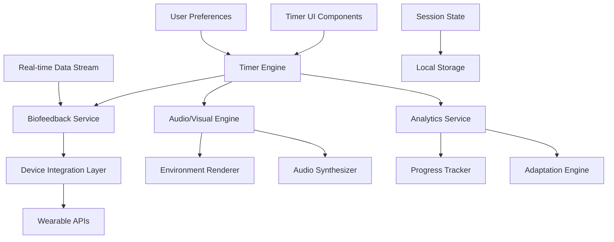
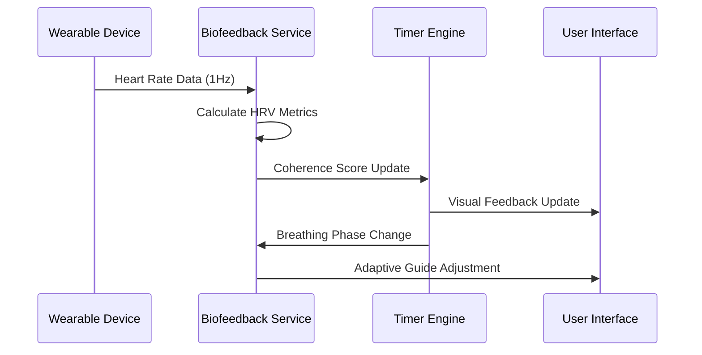

# Design Document

## Overview

The Interactive Exercise Timer with Biofeedback is designed as an immersive, intelligent system that transforms basic exercise timing into a comprehensive biofeedback-enhanced experience. The system integrates seamlessly with the existing Human Body Manual application while introducing advanced features like real-time HRV monitoring, adaptive visual breathing guides, immersive environments, and progressive skill development.

The design emphasizes user experience, scientific accuracy, and spiritual enhancement, creating a bridge between ancient wellness practices and modern biometric technology. The system is built to be extensible, allowing for future integration with various wearable devices and biometric sensors while maintaining the application's core aesthetic and philosophical principles.

## Architecture

### System Architecture Overview

The Interactive Exercise Timer follows a modular, event-driven architecture that supports real-time data processing and responsive user interactions:



**Timer Engine**: Core orchestration service that manages exercise sessions, timing, and state transitions. Handles session lifecycle, pause/resume functionality, and coordination between different system components.

**Biofeedback Service**: Processes real-time biometric data from connected devices, calculates HRV metrics, coherence scores, and provides adaptive feedback based on physiological responses.

**Audio/Visual Engine**: Manages immersive environments, breathing guide animations, and synchronized audio experiences. Utilizes Web Audio API for precise audio timing and Canvas/WebGL for smooth visual animations.

**Device Integration Layer**: Abstracts communication with various wearable devices and heart rate monitors through standardized APIs, supporting Bluetooth Web API and vendor-specific SDKs.

**Analytics Service**: Processes session data, generates insights, tracks progress patterns, and feeds the adaptation engine for personalized recommendations.

### Real-time Data Processing Pipeline



## Components and Interfaces

### Core Components

**InteractiveTimer Component**
- Main container component managing session state and orchestrating child components
- Handles session lifecycle (start, pause, resume, complete)
- Manages real-time data streams and device connections
- Provides context for all timer-related child components

**BreathingGuide Component**
- Animated visual guide using SVG or Canvas for smooth 60fps animations
- Adaptive sizing and timing based on user performance and biometric feedback
- Multiple visualization styles (circle expansion, wave patterns, geometric shapes)
- Accessibility features including reduced motion options

**BiofeedbackDisplay Component**
- Real-time HRV and heart rate visualization with smooth data interpolation
- Coherence score indicators with color-coded feedback
- Historical session comparison overlays
- Privacy-conscious data display with user-controlled visibility

**EnvironmentRenderer Component**
- Immersive background environments using CSS animations and WebGL where supported
- Dynamic lighting and particle effects synchronized with breathing rhythms
- Performance-optimized rendering with fallback options for lower-end devices
- Customizable intensity and theme options

**SessionAnalytics Component**
- Post-session detailed analytics with interactive charts
- Progress comparison with previous sessions
- Technique improvement suggestions based on performance data
- Shareable progress summaries with privacy controls

### Service Interfaces

**ITimerEngine Interface**
```typescript
interface ITimerEngine {
  startSession(exerciseConfig: ExerciseConfig): Promise<SessionId>;
  pauseSession(sessionId: SessionId): Promise<void>;
  resumeSession(sessionId: SessionId): Promise<void>;
  completeSession(sessionId: SessionId): Promise<SessionSummary>;
  updateSessionConfig(sessionId: SessionId, config: Partial<ExerciseConfig>): Promise<void>;
  getSessionState(sessionId: SessionId): Promise<SessionState>;
}
```

**IBiofeedbackService Interface**
```typescript
interface IBiofeedbackService {
  connectDevice(deviceType: DeviceType): Promise<DeviceConnection>;
  startDataStream(deviceId: string): Promise<DataStream>;
  processHeartRateData(data: HeartRateData): Promise<HRVMetrics>;
  calculateCoherence(hrvData: HRVMetrics[]): Promise<CoherenceScore>;
  getAdaptiveRecommendations(sessionData: SessionData): Promise<Recommendation[]>;
}
```

**IAudioVisualEngine Interface**
```typescript
interface IAudioVisualEngine {
  loadEnvironment(environmentId: string): Promise<Environment>;
  startBreathingGuide(config: BreathingConfig): Promise<GuideInstance>;
  syncAudioToBreathing(breathingPhase: BreathingPhase): Promise<void>;
  updateVisualIntensity(intensity: number): Promise<void>;
  generateAmbientAudio(environment: Environment, duration: number): Promise<AudioBuffer>;
}
```

## Data Models

### Core Data Models

**ExerciseConfig Model**
```typescript
interface ExerciseConfig {
  exerciseId: string;
  duration: number;
  breathingPattern: BreathingPattern;
  environment: EnvironmentConfig;
  biofeedbackEnabled: boolean;
  adaptiveMode: boolean;
  difficultyLevel: DifficultyLevel;
  customizations: TimerCustomizations;
}

interface BreathingPattern {
  inhaleSeconds: number;
  holdSeconds: number;
  exhaleSeconds: number;
  cycles: number;
  adaptiveRhythm: boolean;
}
```

**SessionState Model**
```typescript
interface SessionState {
  sessionId: string;
  status: 'preparing' | 'active' | 'paused' | 'completed';
  currentPhase: BreathingPhase;
  elapsedTime: number;
  remainingTime: number;
  currentCycle: number;
  totalCycles: number;
  biometricData: BiometricSnapshot[];
  coherenceScore: number;
  adaptations: SessionAdaptation[];
}
```

**BiometricSnapshot Model**
```typescript
interface BiometricSnapshot {
  timestamp: number;
  heartRate: number;
  hrvScore: number;
  coherenceLevel: CoherenceLevel;
  stressIndicator: number;
  breathingQuality: number;
  deviceId: string;
  confidence: number;
}
```

**SessionSummary Model**
```typescript
interface SessionSummary {
  sessionId: string;
  exerciseId: string;
  startTime: Date;
  duration: number;
  completionRate: number;
  averageCoherence: number;
  hrvImprovement: number;
  breathingAccuracy: number;
  stressReduction: number;
  personalBests: PersonalBest[];
  recommendations: Recommendation[];
  achievements: Achievement[];
}
```

### Environment and Customization Models

**EnvironmentConfig Model**
```typescript
interface EnvironmentConfig {
  id: string;
  name: string;
  visualTheme: VisualTheme;
  audioProfile: AudioProfile;
  intensity: number;
  customizations: EnvironmentCustomizations;
}

interface VisualTheme {
  backgroundType: 'gradient' | 'animated' | 'video' | 'particles';
  colorPalette: ColorPalette;
  animationSpeed: number;
  particleCount?: number;
  lightingEffects: boolean;
}

interface AudioProfile {
  ambientSounds: string[];
  breathingSyncAudio: boolean;
  binauralBeats?: BinauralConfig;
  volume: number;
  fadeInOut: boolean;
}
```

## Error Handling

### Error Categories and Recovery Strategies

**Device Connection Errors**
- Bluetooth connection failures with automatic retry logic
- Device compatibility issues with graceful fallback to manual tracking
- Data transmission interruptions with buffering and recovery mechanisms
- Battery level monitoring with low-power mode transitions

**Real-time Processing Errors**
- HRV calculation errors with data validation and smoothing algorithms
- Audio/visual synchronization issues with adaptive timing correction
- Performance degradation handling with automatic quality adjustments
- Memory management for long sessions with efficient data structures

**User Experience Errors**
- Session interruption handling with state preservation and recovery options
- Network connectivity issues with offline mode capabilities
- Browser compatibility problems with progressive enhancement strategies
- Accessibility issues with comprehensive fallback options

### Error Recovery Implementation

```typescript
class TimerErrorHandler {
  static async handleDeviceError(error: DeviceError, context: TimerContext) {
    switch (error.type) {
      case 'CONNECTION_LOST':
        await this.attemptReconnection(error.deviceId, 3);
        break;
      case 'DATA_INVALID':
        await this.switchToManualMode(context.sessionId);
        break;
      case 'DEVICE_INCOMPATIBLE':
        await this.showCompatibilityGuidance(error.deviceInfo);
        break;
    }
  }

  static async preserveSessionState(sessionId: string, state: SessionState) {
    // Implement robust state preservation for session recovery
    await localStorage.setItem(`session_${sessionId}`, JSON.stringify(state));
  }
}
```

## Testing Strategy

### Component Testing Approach

**Timer Component Testing**
- State management testing for all session lifecycle phases
- Real-time data processing testing with mock biometric data
- Animation performance testing with frame rate monitoring
- Accessibility testing for screen readers and keyboard navigation

**Biofeedback Integration Testing**
- Mock device integration testing with simulated HRV data
- Data processing accuracy testing with known input/output pairs
- Real-time feedback testing with timing precision verification
- Error handling testing for various device failure scenarios

### Performance Testing

**Real-time Performance Requirements**
- 60fps animation rendering for breathing guides
- Sub-100ms latency for biometric data processing
- Smooth audio playback without dropouts or glitches
- Memory usage optimization for extended sessions (60+ minutes)

**Load Testing Scenarios**
- Multiple concurrent timer sessions
- Extended session duration testing (up to 2 hours)
- Device connection/disconnection stress testing
- Background tab performance optimization

### User Experience Testing

**Usability Testing Focus Areas**
- Breathing guide effectiveness and user synchronization
- Biofeedback clarity and actionability
- Environment immersion and distraction levels
- Session completion satisfaction and motivation

**Accessibility Testing**
- Screen reader compatibility for all timer functions
- Keyboard navigation for all interactive elements
- Color contrast compliance for visual feedback
- Motion sensitivity options for users with vestibular disorders

## Security and Privacy Considerations

### Biometric Data Protection

**Data Minimization**
- Only collect necessary biometric data for session functionality
- Automatic data purging after configurable retention periods
- User control over data collection granularity and storage duration
- Opt-in consent for all biometric data collection and processing

**Device Security**
- Secure Bluetooth communication with encryption
- Device authentication and pairing verification
- Protection against unauthorized device access
- Regular security updates for device integration protocols

### Privacy Controls

**User Data Ownership**
- Complete control over biometric data sharing and export
- Granular privacy settings for different data types
- Anonymous usage analytics with user consent
- Right to deletion with complete data removal

**Session Privacy**
- Local-first data processing where possible
- Encrypted storage for sensitive session data
- Optional cloud sync with end-to-end encryption
- Session sharing controls with privacy-preserving options

## Integration Points

### Existing Application Integration

**Exercise System Integration**
- Seamless replacement of existing basic timers
- Backward compatibility with current exercise configurations
- Progress tracking integration with enhanced session data
- Achievement system integration with biofeedback milestones

**User Profile Integration**
- Personalization based on existing user preferences
- Integration with user's body area focus and skill levels
- Synchronization with existing progress tracking systems
- Customization persistence across devices and sessions

### Future Extension Points

**Advanced Biometric Integration**
- EEG integration for meditation depth measurement
- Breath sensor integration for precise breathing tracking
- Stress hormone correlation through wearable biochemical sensors
- Sleep quality integration for optimal session timing

**AI and Machine Learning Enhancement**
- Personalized breathing pattern optimization
- Predictive session recommendations based on user patterns
- Adaptive difficulty progression using reinforcement learning
- Anomaly detection for health monitoring and early intervention

This design provides a comprehensive foundation for creating an advanced, biofeedback-enhanced exercise timer that maintains the spiritual and wellness focus of the Human Body Manual while introducing cutting-edge technology for optimal user experience and health outcomes.