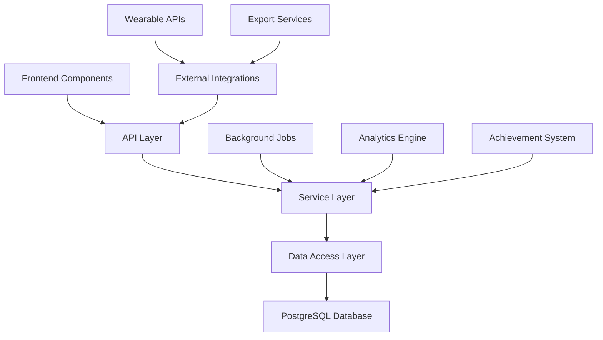

# Design Document

## Overview

The User Progress Tracking System is designed as a comprehensive, data-driven feature that seamlessly integrates with the existing Human Body Manual application architecture. The system leverages modern web technologies to provide real-time progress tracking, visual analytics, and gamification elements while maintaining the application's spiritual-conscious aesthetic and user experience principles.

The design follows a modular architecture that can scale with user growth and integrates with the existing Next.js 14 application, Prisma ORM, and PostgreSQL database. The system emphasizes user privacy, data ownership, and meaningful progress visualization that aligns with the holistic wellness philosophy of the application.

## Architecture

### System Architecture Overview

The progress tracking system follows a layered architecture pattern:



**Frontend Layer**: React components with TypeScript, utilizing the existing design system and Framer Motion for animations. Components include progress dashboards, achievement displays, calendar heatmaps, and statistical visualizations.

**API Layer**: Next.js API routes with tRPC for type-safe client-server communication. Handles authentication, data validation, and rate limiting.

**Service Layer**: Business logic services including ProgressTracker, AchievementEngine, AnalyticsService, and RecommendationEngine. These services orchestrate data operations and implement complex business rules.

**Data Access Layer**: Prisma ORM with optimized queries for progress data retrieval and aggregation. Includes caching strategies using Redis for frequently accessed data.

**Background Processing**: Queue-based system for processing analytics, generating insights, and sending notifications without blocking user interactions.

### Database Schema Extensions

The system extends the existing database schema with new tables:

```sql
-- Progress tracking core tables
CREATE TABLE user_progress (
  id UUID PRIMARY KEY DEFAULT gen_random_uuid(),
  user_id UUID NOT NULL REFERENCES users(id),
  exercise_id VARCHAR NOT NULL,
  body_area VARCHAR NOT NULL,
  completed_at TIMESTAMP NOT NULL,
  duration_minutes INTEGER,
  difficulty_level VARCHAR NOT NULL,
  session_notes TEXT,
  biometric_data JSONB,
  created_at TIMESTAMP DEFAULT NOW()
);

-- Achievement system
CREATE TABLE achievements (
  id UUID PRIMARY KEY DEFAULT gen_random_uuid(),
  name VARCHAR NOT NULL,
  description TEXT NOT NULL,
  category VARCHAR NOT NULL,
  criteria JSONB NOT NULL,
  badge_icon VARCHAR,
  points INTEGER DEFAULT 0,
  rarity VARCHAR DEFAULT 'common'
);

CREATE TABLE user_achievements (
  id UUID PRIMARY KEY DEFAULT gen_random_uuid(),
  user_id UUID NOT NULL REFERENCES users(id),
  achievement_id UUID NOT NULL REFERENCES achievements(id),
  earned_at TIMESTAMP DEFAULT NOW(),
  progress_snapshot JSONB
);

-- Streak tracking
CREATE TABLE user_streaks (
  id UUID PRIMARY KEY DEFAULT gen_random_uuid(),
  user_id UUID NOT NULL REFERENCES users(id),
  streak_type VARCHAR NOT NULL,
  current_count INTEGER DEFAULT 0,
  best_count INTEGER DEFAULT 0,
  last_activity_date DATE,
  started_at TIMESTAMP DEFAULT NOW()
);

-- Analytics and insights
CREATE TABLE user_insights (
  id UUID PRIMARY KEY DEFAULT gen_random_uuid(),
  user_id UUID NOT NULL REFERENCES users(id),
  insight_type VARCHAR NOT NULL,
  content JSONB NOT NULL,
  generated_at TIMESTAMP DEFAULT NOW(),
  viewed_at TIMESTAMP
);
```

## Components and Interfaces

### Core Components

**ProgressDashboard Component**
- Displays comprehensive progress overview with calendar heatmap
- Shows current streaks, total sessions, and favorite body areas
- Integrates achievement showcase and recent activity feed
- Responsive design adapting from mobile to desktop layouts

**BodyAreaProgress Component**
- Area-specific progress visualization with circular progress indicators
- Exercise completion rates and mastery levels
- Time-based analytics showing practice patterns
- Recommendations for next exercises based on current progress

**AchievementSystem Component**
- Badge collection display with rarity indicators
- Achievement progress bars for in-progress milestones
- Celebration animations using Framer Motion
- Social sharing capabilities for major achievements

**AnalyticsCharts Component**
- Interactive charts using Recharts library
- Weekly/monthly progress trends
- Comparative analysis across body areas
- Biometric correlation visualizations when available

### Service Interfaces

**IProgressTracker Interface**
```typescript
interface IProgressTracker {
  recordCompletion(userId: string, exerciseData: ExerciseCompletion): Promise<ProgressEntry>;
  getUserProgress(userId: string, timeRange?: DateRange): Promise<UserProgress>;
  getStreakData(userId: string): Promise<StreakData>;
  getBodyAreaStats(userId: string, bodyArea: string): Promise<AreaStats>;
}
```

**IAchievementEngine Interface**
```typescript
interface IAchievementEngine {
  checkAchievements(userId: string, progressData: ProgressEntry): Promise<Achievement[]>;
  getUserAchievements(userId: string): Promise<UserAchievement[]>;
  calculateProgress(userId: string, achievementId: string): Promise<AchievementProgress>;
}
```

**IAnalyticsService Interface**
```typescript
interface IAnalyticsService {
  generateInsights(userId: string): Promise<UserInsight[]>;
  getProgressTrends(userId: string, timeRange: DateRange): Promise<TrendData>;
  getRecommendations(userId: string): Promise<Recommendation[]>;
}
```

## Data Models

### Core Data Models

**ProgressEntry Model**
```typescript
interface ProgressEntry {
  id: string;
  userId: string;
  exerciseId: string;
  bodyArea: BodyAreaType;
  completedAt: Date;
  durationMinutes?: number;
  difficultyLevel: DifficultyLevel;
  sessionNotes?: string;
  biometricData?: BiometricSnapshot;
  mood?: MoodRating;
  energyLevel?: EnergyRating;
}
```

**UserProgress Model**
```typescript
interface UserProgress {
  userId: string;
  totalSessions: number;
  totalMinutes: number;
  currentStreak: number;
  longestStreak: number;
  bodyAreaStats: BodyAreaStats[];
  recentAchievements: Achievement[];
  weeklyGoal: number;
  weeklyProgress: number;
  lastActivity: Date;
}
```

**Achievement Model**
```typescript
interface Achievement {
  id: string;
  name: string;
  description: string;
  category: AchievementCategory;
  criteria: AchievementCriteria;
  badgeIcon: string;
  points: number;
  rarity: 'common' | 'rare' | 'epic' | 'legendary';
  unlocksContent?: string[];
}
```

### Biometric Integration Models

**BiometricSnapshot Model**
```typescript
interface BiometricSnapshot {
  heartRate?: number;
  hrv?: number;
  stressLevel?: number;
  sleepQuality?: number;
  recoveryScore?: number;
  timestamp: Date;
  source: 'manual' | 'wearable' | 'app';
}
```

## Error Handling

### Error Categories and Strategies

**Data Validation Errors**
- Client-side validation using Zod schemas
- Server-side validation with detailed error messages
- Graceful degradation when optional data is missing

**Database Errors**
- Connection pooling and retry logic
- Graceful handling of constraint violations
- Data consistency checks for progress calculations

**External API Errors**
- Timeout handling for wearable device integrations
- Fallback mechanisms when external services are unavailable
- User notification system for integration issues

**Performance Errors**
- Query optimization for large datasets
- Pagination for progress history
- Caching strategies for frequently accessed data

### Error Recovery Mechanisms

```typescript
class ProgressTrackingError extends Error {
  constructor(
    message: string,
    public code: string,
    public recoverable: boolean = true
  ) {
    super(message);
  }
}

// Error handling service
class ErrorHandler {
  static async handleProgressError(error: ProgressTrackingError, context: string) {
    if (error.recoverable) {
      // Attempt recovery strategies
      await this.attemptRecovery(error, context);
    } else {
      // Log critical error and notify administrators
      await this.logCriticalError(error, context);
    }
  }
}
```

## Testing Strategy

### Unit Testing Approach

**Service Layer Testing**
- Comprehensive unit tests for ProgressTracker service
- Mock database interactions using Jest and Prisma mock
- Achievement engine logic testing with various scenarios
- Analytics service testing with sample data sets

**Component Testing**
- React Testing Library for component behavior testing
- Visual regression testing for progress visualizations
- Accessibility testing for all progress tracking components
- Mobile responsiveness testing across device sizes

### Integration Testing

**API Integration Tests**
- End-to-end API testing with test database
- Authentication and authorization testing
- Rate limiting and error handling verification
- Data consistency testing across related operations

**Database Integration Tests**
- Migration testing for schema changes
- Performance testing with large datasets
- Data integrity testing for complex queries
- Backup and recovery testing procedures

### Performance Testing

**Load Testing Scenarios**
- Concurrent user progress tracking
- Large dataset query performance
- Real-time achievement processing
- Dashboard rendering with extensive data

**Optimization Strategies**
- Database query optimization and indexing
- Redis caching for frequently accessed data
- Component memoization for expensive calculations
- Lazy loading for historical progress data

### User Acceptance Testing

**Usability Testing Focus Areas**
- Progress visualization clarity and usefulness
- Achievement system motivation and engagement
- Mobile experience optimization
- Accessibility compliance verification

**Beta Testing Program**
- Gradual rollout to existing active users
- Feedback collection through in-app surveys
- A/B testing for different progress visualization approaches
- Community feedback integration and iteration

## Security and Privacy Considerations

### Data Privacy Protection

**User Data Ownership**
- Complete data export functionality
- Granular privacy controls for sharing features
- Right to deletion with complete data removal
- Transparent data usage policies

**Anonymization Strategies**
- Community statistics with complete user anonymization
- Differential privacy for aggregate data sharing
- Secure data aggregation without individual identification
- Regular privacy impact assessments

### Security Measures

**Data Protection**
- Encryption at rest for sensitive progress data
- Secure API endpoints with proper authentication
- Input validation and sanitization
- Regular security audits and penetration testing

**Access Control**
- Role-based access control for administrative features
- User session management and timeout policies
- API rate limiting to prevent abuse
- Audit logging for sensitive operations

This design provides a comprehensive foundation for implementing a robust, scalable, and user-centric progress tracking system that enhances the Human Body Manual application while maintaining its core values of privacy, wellness, and spiritual consciousness.